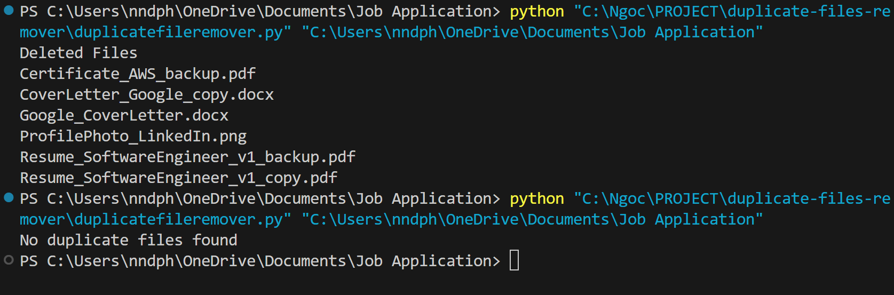

# Duplicate Files Remover
The purpose is to remove duplicate files in the same/ different directory where the script is run.

### Prerequisites
* No external libraries are used
* os
* hashlib

### Run the script by providing its full path
Use the `Job Application` folder for reference if needed
Execute `python duplicatefileremover.py` 

### Screenshot/GIF showing the sample use of the script

## Working
The script first lists all the files in the directory. It takes MD5 hash of each file, when hash of 2 files become same it deletes the file.

## Limitation
* No confirmation before deletion; safety risk.
* It only works on the the directory you specify or by default
* Logic: Deletes random duplicate, not smartest choice

## Further consideration
* Production use
* Optional support for scanning cloud folders like OneDrive, Google Drive, or Dropbox.
* Provide a more user-friendly interface or command-line options for easier usage.
* Maintain a log of deleted files with timestamps for tracking and recovery purposes.
